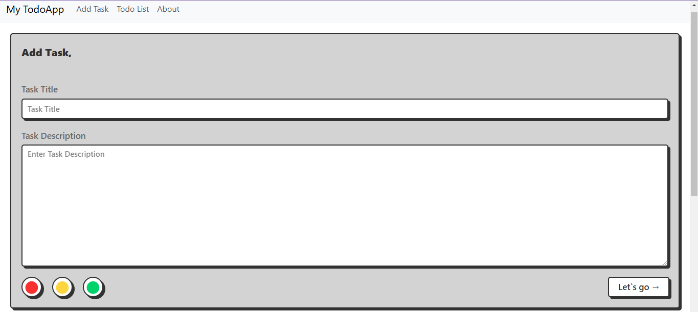
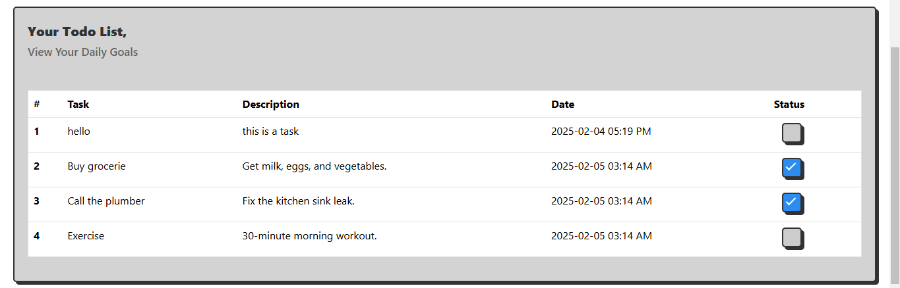

# Todo List Project

## Description
This project is a simple Todo List application that allows users to create, read, update, and delete tasks. It provides a user-friendly interface to manage tasks efficiently.

## Features
- Add new tasks
- View existing tasks
- Edit tasks
- Delete tasks
- Responsive design

## Installation
1. Clone the repository:
   ```bash
   git clone https://github.com/yourusername/todo-list.git
   ```
2. Navigate to the project directory:
   ```bash
   cd todo-list
   ```
3. Install the required dependencies:
   ```bash
   pip install -r requirements.txt
   ```

## Usage
1. Run the application:
   ```bash
   python app.py
   ```
2. Open your web browser and go to `http://localhost:5000` to access the Todo List application.

## Contributing
Contributions are welcome! Please open an issue or submit a pull request for any improvements or features.

## Technology Stack
- Python
- Flask
- HTML
- CSS
- JavaScript

## Screenshots



## License
This project is licensed under the MIT License.
